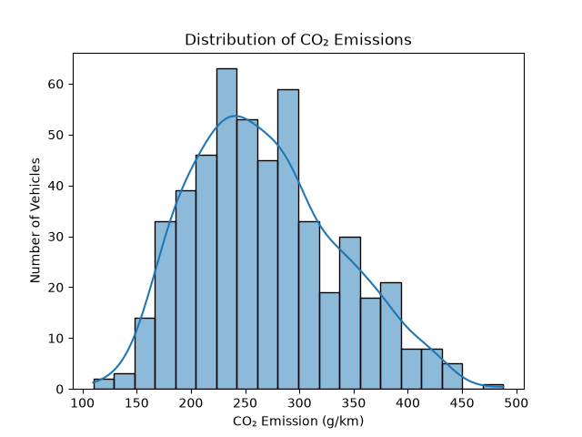
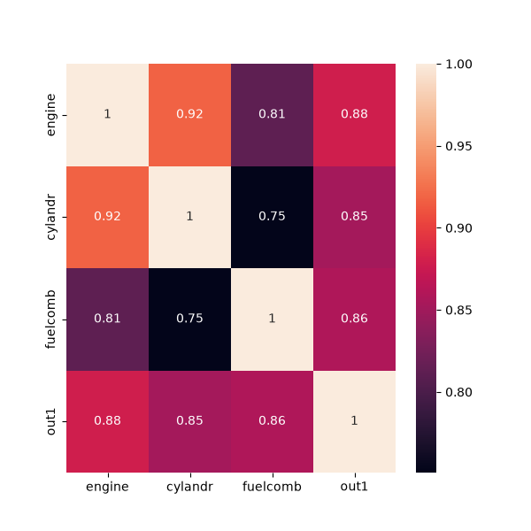
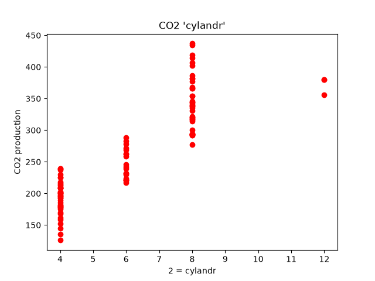
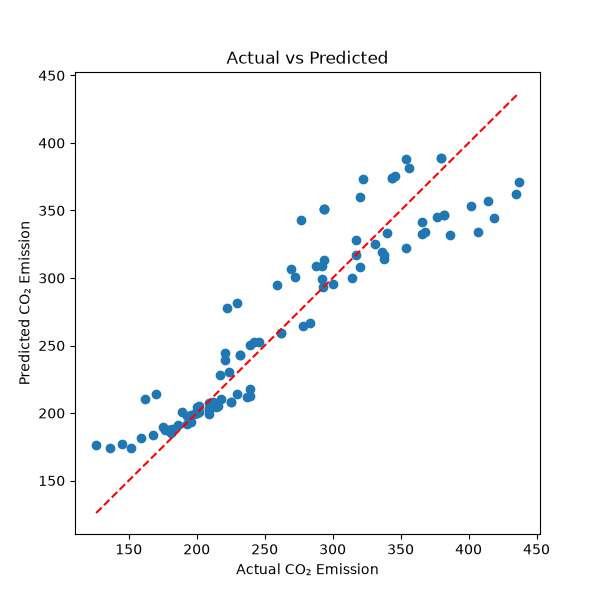

# CO₂ Emission Prediction using Linear Regression

A machine learning project that predicts vehicle CO₂ emissions using Multiple Linear Regression. The project performs data visualization, correlation analysis, model training, prediction, and evaluation using Python and Scikit-learn.

## Features

* Predicts vehicle CO₂ emissions using Multiple Linear Regression
* Performs data visualization with Seaborn and Matplotlib
* Displays a correlation heatmap between features
* Splits the dataset into training and testing sets
* Evaluates model performance using common regression metrics
* Predicts the CO₂ emission of a sample vehicle
* Visualizes Actual vs Predicted values

## Technologies Used

* Python 3
* NumPy
* Pandas
* Matplotlib
* Seaborn
* Scikit-learn

## Project Structure

```text
CO2-Emission-Prediction/
│
├── co2 prediction.py
├── co2.csv
├── requirements.txt
├── README.md
├── LICENSE
│
└── Images/
    ├── Distribution_of_CO₂_Emissions.png
    ├── actual_vs_predicted.png
    ├── correlation_heatmap.png
    ├── cylinder_scatter.png
    ├── engine_scatter.png
    └── fuel_scatter.png
```

## Dataset

The dataset contains vehicle information used to estimate CO₂ emissions.

### Input Features

* Engine Size
* Number of Cylinders
* Combined Fuel Consumption

### Target

* CO₂ Emission (g/km)

## Installation

### 1. Clone the repository

```bash
git clone https://github.com/Matin-python/CO2-Emission-Prediction-Linear-Regression.git
cd CO2-Emission-Prediction-Linear-Regression
```

### 2. (Optional) Create a virtual environment

```bash
python -m venv venv
```

Activate it:

**Windows**

```bash
venv\Scripts\activate
```

**Linux/macOS**

```bash
source venv/bin/activate
```

### 3. Install dependencies

```bash
pip install -r requirements.txt
```

## Usage

Run the program:

```bash
python co2 prediction.py
```

The application will:

1. Load the dataset.
2. Display the class distribution.
3. Generate a correlation heatmap.
4. Train a Multiple Linear Regression model.
5. Predict CO₂ emissions for the test data.
6. Predict the CO₂ emission of a sample vehicle.
7. Display evaluation metrics and visualizations.

## Results

### Distribution of CO₂ Emissions



### Correlation Heatmap



### Engine/Cylinder/Fuel Size vs CO₂ Emission





### Actual vs Predicted



## Example Prediction

Sample vehicle:

```text
Engine Size: 1.36 L
Cylinders: 4
Combined Fuel Consumption: 5 L/100 km
```

Example output:

```text
Peugeot 206 CO₂ Emission Prediction: XXX g/km
Actual CO₂ Emission: 149 g/km
```

## Model Evaluation

The project reports several evaluation metrics:

* Mean Percentage Error
* Mean Absolute Error (MAE)
* Mean Squared Error (MSE)

These metrics help measure how accurately the model predicts CO₂ emissions.

## Visualizations

The project generates several plots:

* Vehicle CO₂ distribution
* Correlation heatmap
* Engine Size vs CO₂ Emission
* Number of Cylinders vs CO₂ Emission
* Fuel Consumption vs CO₂ Emission
* Actual vs Predicted CO₂ Emission

## Related Project

This project also has a Deep Learning implementation using TensorFlow/Keras.

If you'd like to compare the performance of a traditional Machine Learning model with a Neural Network on the same dataset, check out:

➡️ CO₂ Emission Prediction using Deep Learning

[https://github.com/Matin-python/PLC-Communication-Manual-Modbus-ASCII](https://github.com/Matin-python/CO2-Emission-Prediction-Deep-Learning)

## Future Improvements

* Add support for multiple regression models
* Compare model performance (Linear Regression, Decision Tree, Random Forest, etc.)
* Perform feature scaling
* Add feature importance analysis
* Implement cross-validation
* Create an interactive prediction interface
* Deploy the model as a web application

## License

This project is licensed under the MIT License.

## Author

**Mohammad Reza Bakhshandeh**

Electrical Engineering (Electronics) Graduate

Interested in Python Development, Machine Learning, Computer Vision, Artificial Intelligence, and Data Science.
